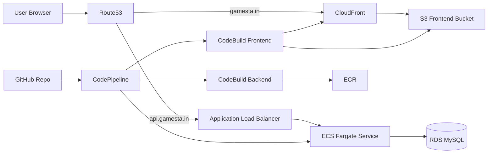

# Activity-3 AWS Execution Plan

This plan is aligned to the assignment criteria:

1. Architecture Diagram
2. Infrastructure using CloudFormation
3. CI/CD Pipeline
4. Domain Name using Route53

## 0) Your Fixed Inputs

- Region: ap-south-1
- Frontend domain: gamesta.in
- API domain: api.gamesta.in
- GitHub repository: PranavParalkar/Gamesta_SpringBoot

Important: CloudFront custom-domain ACM certificate must be in us-east-1.

## 1) Architecture Diagram (for submission)



## 2) CloudFormation Templates Added

- infra/cloudformation/01-network.yml
- infra/cloudformation/02-backend.yml
- infra/cloudformation/03-frontend.yml
- infra/cloudformation/04-dns.yml
- infra/cloudformation/05-cicd.yml

## 3) CI/CD Build Specs Added

- buildspec-backend.yml
- buildspec-frontend.yml

## 4) Deployment Order

Run from project root. Commands below are pre-filled for your domain, region, and repo.

### Step 0: Set PowerShell variables once

```powershell
$REGION = "ap-south-1"
$FRONTEND_DOMAIN = "gamesta.in"
$API_DOMAIN = "api.gamesta.in"
$GITHUB_REPO_ID = "PranavParalkar/Gamesta_SpringBoot"

# Fill these with your account values
$ACCOUNT_ID = "<aws-account-id>"
$HOSTED_ZONE_ID = "<route53-hosted-zone-id-for-gamesta.in>"
$ACM_CERT_ARN_US_EAST_1 = "<acm-certificate-arn-in-us-east-1-for-gamesta.in>"
$CODESTAR_CONNECTION_ARN = "<codestar-connection-arn>"
$DB_PASSWORD = "<secure-db-password>"
$ADMIN_SECRET = "<admin-secret>"
```

### Step A: Deploy network

```powershell
aws cloudformation deploy --stack-name gamesta-network --template-file infra/cloudformation/01-network.yml --region $REGION --capabilities CAPABILITY_NAMED_IAM
```

```powershell
$VPC_ID = aws cloudformation describe-stacks --stack-name gamesta-network --region $REGION --query "Stacks[0].Outputs[?OutputKey=='VpcId'].OutputValue" --output text
$PUB1 = aws cloudformation describe-stacks --stack-name gamesta-network --region $REGION --query "Stacks[0].Outputs[?OutputKey=='PublicSubnet1Id'].OutputValue" --output text
$PUB2 = aws cloudformation describe-stacks --stack-name gamesta-network --region $REGION --query "Stacks[0].Outputs[?OutputKey=='PublicSubnet2Id'].OutputValue" --output text
$PVT1 = aws cloudformation describe-stacks --stack-name gamesta-network --region $REGION --query "Stacks[0].Outputs[?OutputKey=='PrivateSubnet1Id'].OutputValue" --output text
$PVT2 = aws cloudformation describe-stacks --stack-name gamesta-network --region $REGION --query "Stacks[0].Outputs[?OutputKey=='PrivateSubnet2Id'].OutputValue" --output text
```

### Step B: Create ECR repo and backend stack

Use a temporary public image for first stack creation, then pipeline will push your app image to ECR and update ECS.

```powershell
aws cloudformation deploy --stack-name gamesta-backend --template-file infra/cloudformation/02-backend.yml --region $REGION --capabilities CAPABILITY_NAMED_IAM --parameter-overrides VpcId=$VPC_ID PublicSubnet1Id=$PUB1 PublicSubnet2Id=$PUB2 PrivateSubnet1Id=$PVT1 PrivateSubnet2Id=$PVT2 BackendImage=public.ecr.aws/docker/library/nginx:latest DbPassword=$DB_PASSWORD AdminSecret=$ADMIN_SECRET
```

```powershell
$ECR_REPO_URI = aws cloudformation describe-stacks --stack-name gamesta-backend --region $REGION --query "Stacks[0].Outputs[?OutputKey=='EcrRepositoryUri'].OutputValue" --output text
$ECS_CLUSTER = aws cloudformation describe-stacks --stack-name gamesta-backend --region $REGION --query "Stacks[0].Outputs[?OutputKey=='ClusterName'].OutputValue" --output text
$ECS_SERVICE = aws cloudformation describe-stacks --stack-name gamesta-backend --region $REGION --query "Stacks[0].Outputs[?OutputKey=='ServiceName'].OutputValue" --output text
$ALB_DNS = aws cloudformation describe-stacks --stack-name gamesta-backend --region $REGION --query "Stacks[0].Outputs[?OutputKey=='AlbDnsName'].OutputValue" --output text
$ALB_ZONE = aws cloudformation describe-stacks --stack-name gamesta-backend --region $REGION --query "Stacks[0].Outputs[?OutputKey=='AlbHostedZoneId'].OutputValue" --output text
```

### Step C: Deploy frontend stack

```powershell
aws cloudformation deploy --stack-name gamesta-frontend --template-file infra/cloudformation/03-frontend.yml --region $REGION --capabilities CAPABILITY_NAMED_IAM --parameter-overrides FrontendDomainName=$FRONTEND_DOMAIN AcmCertificateArn=$ACM_CERT_ARN_US_EAST_1
```

```powershell
$FRONTEND_BUCKET = aws cloudformation describe-stacks --stack-name gamesta-frontend --region $REGION --query "Stacks[0].Outputs[?OutputKey=='FrontendBucketName'].OutputValue" --output text
$CF_DISTRIBUTION_ID = aws cloudformation describe-stacks --stack-name gamesta-frontend --region $REGION --query "Stacks[0].Outputs[?OutputKey=='CloudFrontDistributionId'].OutputValue" --output text
$CF_DOMAIN = aws cloudformation describe-stacks --stack-name gamesta-frontend --region $REGION --query "Stacks[0].Outputs[?OutputKey=='CloudFrontDomainName'].OutputValue" --output text
```

### Step D: Deploy DNS records

```powershell
aws cloudformation deploy --stack-name gamesta-dns --template-file infra/cloudformation/04-dns.yml --region $REGION --parameter-overrides HostedZoneId=$HOSTED_ZONE_ID FrontendDomainName=$FRONTEND_DOMAIN ApiDomainName=$API_DOMAIN CloudFrontDomainName=$CF_DOMAIN AlbDnsName=$ALB_DNS AlbHostedZoneId=$ALB_ZONE
```

### Step E: Deploy CI/CD pipeline

```powershell
aws cloudformation deploy --stack-name gamesta-cicd --template-file infra/cloudformation/05-cicd.yml --region $REGION --capabilities CAPABILITY_NAMED_IAM --parameter-overrides ConnectionArn=$CODESTAR_CONNECTION_ARN FullRepositoryId=$GITHUB_REPO_ID BranchName=main EcrRepositoryUri=$ECR_REPO_URI EcsClusterName=$ECS_CLUSTER EcsServiceName=$ECS_SERVICE FrontendBucketName=$FRONTEND_BUCKET CloudFrontDistributionId=$CF_DISTRIBUTION_ID ViteApiBaseUrl=http://$API_DOMAIN
```

### Step F: Approve GitHub connection and run first pipeline

After creating the pipeline stack, open AWS Console > CodePipeline and complete the pending CodeStar connection authorization if prompted. Then release a pipeline change.

## 5) Evidence You Should Capture for Grading

1. Architecture diagram image.
2. CloudFormation stacks in CREATE_COMPLETE status.
3. CodePipeline execution success screen.
4. Route53 records for frontend and API.
5. Browser proof:
  - https://gamesta.in
  - http://api.gamesta.in

## 6) Common Viva Questions (and expected answer direction)

1. Why CloudFormation?
   - Infrastructure as code, repeatability, easy rollback, version control.
2. Why ECS Fargate?
   - No server management, scales containers, managed runtime.
3. Why CloudFront in frontend?
   - CDN, caching, lower latency, HTTPS termination.
4. How does CI/CD work here?
   - Commit triggers CodePipeline, backend image to ECR then ECS deploy, frontend build sync to S3 and invalidates CloudFront cache.
