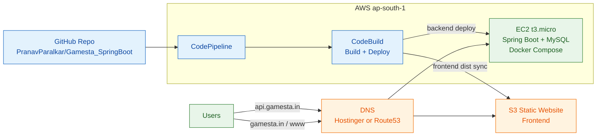

# Activity-3 Architecture Diagram (Low-Cost)

## Endpoints

- Frontend: `http://www.gamesta.in` (or root redirect)
- API: `http://api.gamesta.in`

## Services Included

- DNS provider: Hostinger or Route53
- S3 (frontend static hosting)
- EC2 single instance (backend + database for demo)
- CodePipeline
- CodeBuild

## Why This Is Cheaper

- Removes always-on managed services with higher baseline cost (ECS, RDS, NAT, ALB, CloudFront).
- Uses one small EC2 instance for backend runtime.
- Keeps only required services for assignment completion.
