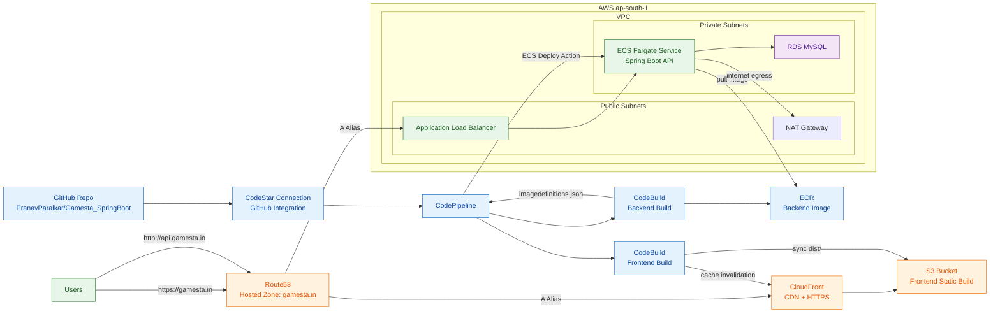

# Activity-3 Architecture Diagram

## Endpoints

- Frontend: https://gamesta.in
- API: http://api.gamesta.in

## Services Included

- Route53
- CloudFront
- S3
- VPC with public and private subnets
- NAT Gateway
- Application Load Balancer
- ECS Fargate
- RDS MySQL
- ECR
- CodeStar Connection
- CodePipeline
- CodeBuild
